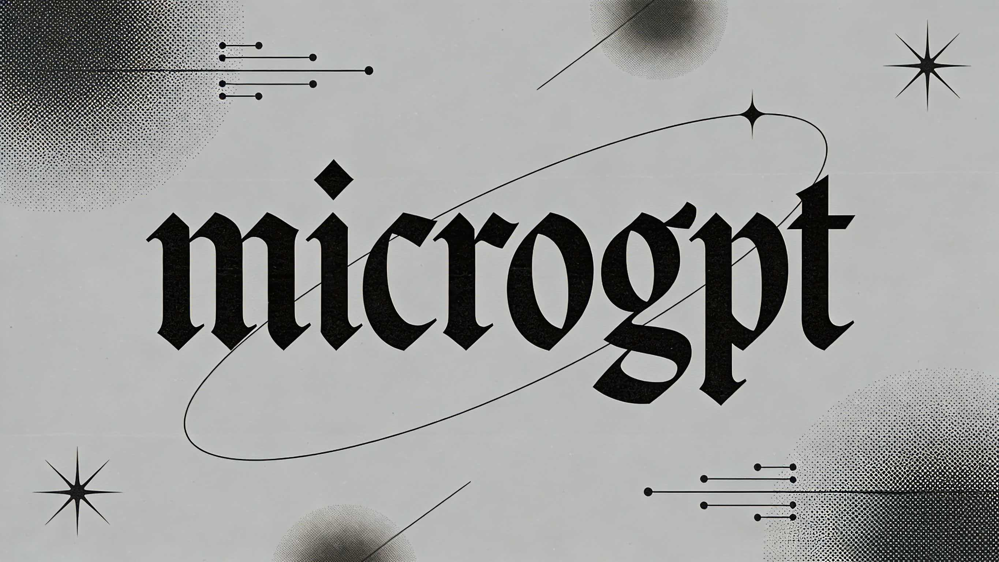

# microgpt (optimized)



Optimized version of [Karpathy's microgpt](https://karpathy.ai/microgpt.html) — the most atomic way to train and inference a GPT in pure, dependency-free Python.

**293 lines, 0 dependencies.** All optimizations preserve the original simplicity.

## What's Changed

| Optimization | Lines | Impact |
|---|---|---|
| Direct `__truediv__` implementation | +8 | ~20-30% fewer computation graph nodes per step |
| Fused `cross_entropy` (log-softmax + NLL) | +5 | Fewer nodes + better numerical stability |
| Iterative `backward()` topological sort | ±0 | Eliminates recursion depth limit |
| `sum(losses[1:], losses[0])` | ±0 | Removes phantom `Value(0)` node |
| Adam β running product | +2 | Numerically stable bias correction at large step counts |
| `with open()` file handle | +1 | Proper resource cleanup |
| **Weight tying** (wte = lm_head) | -1 | Standard GPT-2 practice, 432 fewer params |
| **Cosine LR schedule** | ±0 | Smoother decay than linear, matches Karpathy's latest |
| **Train/val split** (90/10) | +3 | Basic ML hygiene, detect overfitting |
| **Periodic validation** (every 100 steps) | +10 | Pure-float NLL eval on held-out docs |
| **Gradient clipping** (global norm) | +4 | Prevents exploding gradients, stabilizes training |
| **AdamW weight decay** | +1 | Decoupled regularization (Loshchilov & Hutter 2019) |
| **Top-k sampling** (k=5) | +4 | Higher quality inference, avoids garbage tokens |
| **Per-step timing** | +3 | Performance observability in ms/step |

**Total: +50 lines** (243 → 293), no new dependencies.

## Files

- **`microgpt.py`** — The complete optimized algorithm (runnable)
- **`microgpt_optimized.html`** — Syntax-highlighted 3-column view with change annotations

## Quick Start

```bash
python microgpt.py
```

It will auto-download `input.txt` (names dataset) on first run, train for 500 steps with periodic validation, then generate samples via top-k sampling.

## Credits

Original by [@karpathy](https://github.com/karpathy) — [microgpt](https://karpathy.ai/microgpt.html) | [Gist](https://gist.github.com/karpathy/8627fe009c40f57531cb18360106ce95)
